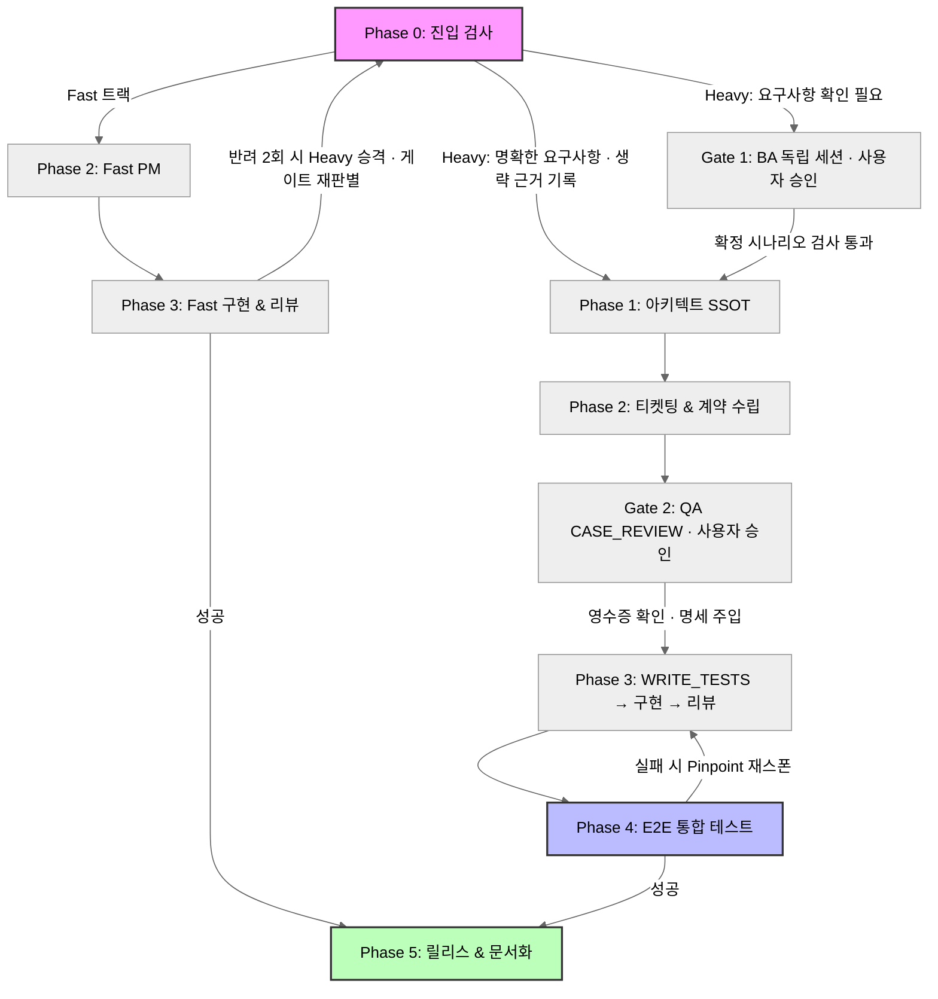

# web-sdlc-harness

Claude Code와 Codex CLI 양쪽에서 쓸 수 있는 하네스 (풀스택 웹 개발)

14개의 에이전트와 14개의 스킬로 **사용자 승인과 개발 자동화를 연결**한다. 요구사항 확인 ➔ 아키텍처 설계 ➔ 티켓팅·계약 ➔ 테스트 명세 승인 ➔ TDD 개발 ➔ E2E 검증 ➔ PR 생성 ➔ 문서화를 수행한다.

호스트별 실행 방식은 다르다. Claude Code는 Phase 3에서 팀 병렬 개발을, Codex는 순차 위임을 사용한다. 설치 시 한쪽 또는 양쪽을 선택할 수 있다.

## 설치

Node.js 16.7 이상과 Git이 필요하다. 대상 프로젝트 루트에서 실행한다.

```bash
npx github:nyj001012/web-sdlc-harness              # 신규 설치 — 옵션 없으면 두 호스트(.claude/·.codex/) 모두
npx github:nyj001012/web-sdlc-harness --claude      # Claude Code 호스트만 설치
npx github:nyj001012/web-sdlc-harness --codex       # Codex 호스트만 설치
npx github:nyj001012/web-sdlc-harness update        # 코어만 최신화 (사용자 자산 보존, 옵션으로 호스트 지정 가능)
npx github:nyj001012/web-sdlc-harness --dry-run     # 쓰지 않고 계획만 확인
npx github:nyj001012/web-sdlc-harness --help        # 전체 옵션
```

GitHub에서 설치하므로 위 명령의 `github:` 스펙을 사용한다. 전역 설치도 가능하다.

```bash
npm install -g github:nyj001012/web-sdlc-harness
web-sdlc-harness --target ./my-project
```

- 정의 파일은 대상 프로젝트에 설치한다. 기존 파일과 충돌하면 쓰기 전에 멈추며, 덮어쓰기는 `--force`로 지정한다.
- `update`는 코어 정의만 교체하고 워크스페이스·사용자 설정·자체 추가 파일을 보존한다.
- 업데이트 후에는 해당 호스트의 설계·시나리오를 재주입하고, Gate 2 승인 상태를 확인한 뒤 새 세션에서 재개한다.
- 런타임 무시 경로는 설치기가 `.gitignore`에 추가한다(「산출물 구조」 참고).

### 호스트별 구성

| 호스트 | 에이전트 | 스킬 | 개발 실행 |
|---|---|---|---|
| Claude Code | `.claude/agents/*.md` | `.claude/skills/` | 팀 병렬 개발 |
| Codex | `.codex/agents/*.toml` | `.agents/skills/` | 서브 에이전트 순차 위임 |

워크스페이스와 설계는 호스트마다 독립이다. 호스트를 바꿔 이어 작업하려면 새 호스트에서 설계를 준비해야 한다. Node가 없으면 오케스트레이터는 작업을 시작하지 않는다.

## 사용법

1. 위 설치를 마친다.
2. Claude Code 또는 Codex CLI에서 하고 싶은 작업을 요청한다. (예: "센서 관제 대시보드를 만들어줘", "로그인 API만 구현해줘")
3. `run_web_sdlc`가 요청 성격에 맞는 페이즈를 골라 실행한다. Gate 1·2가 필요한 경우 사용자 검토를 기다리고, 승인 확인과 명세 주입을 마친 뒤 후속 역할을 시작한다.

기존 프로젝트는 현행 스택을 조사하고, 신규 프로젝트는 아키텍트가 스택을 정한다. 스택 정보가 없으면 추측하지 않고 사용자에게 확인한다.

### Gate 1·2: 사용자와 확정하는 두 단계

| 단계 | 수행 시점 | 사용자 승인 대상 |
|---|---|---|
| **Gate 1 — 요구사항** | Phase 0, 설계·계약 이전 | BA와 정제한 Gherkin 완성본(`scenario.feature`) |
| **Gate 2 — 테스트 명세** | 계약 확정 후, 테스트·개발·DB 구현 이전 | QA와 필수·경계·예외 케이스를 선택한 완성본(`test-cases.md`) |

Heavy에서 요구사항이 불명확하면 Gate 1, TDD QA가 필요하면 Gate 2를 수행한다. Gate 1은 현재 요청에 맞는 명확한 요구사항이나 승인된 시나리오가 있으면 근거를 기록하고 생략한다. Fast·문서·하네스 메타는 두 게이트를 생략하며, 인프라 단독은 Gate 2를 생략한다. FE/BE 단독 Heavy는 Gate 2를 Phase 3 시작 시 수행한다.

BA와 QA 명세 검토(**CASE_REVIEW**)는 아래 **독립 세션**에서 진행한다. 그동안 오케스트레이터는 `[WAITING_USER]`로 기다린다.

| 호스트 | Gate 1 | Gate 2 |
|---|---|---|
| Claude Code | 별도 터미널에서 `claude --agent business-analyst` 실행 | 별도 터미널에서 `claude --agent backend-qa` 또는 `frontend-qa` 실행; CASE_REVIEW로 명세 검토 |
| Codex | 새 Codex 세션에서 `refine_requirements` 스킬 직접 실행 | 새 Codex 세션에서 `design_backend_tdd_cases` 또는 `design_frontend_tdd_cases` 스킬을 CASE_REVIEW 모드로 직접 실행 |

Codex 스킬 직접 실행은 QA TOML을 자동 주입받지 않는다. 오케스트레이터가 입력을 준비하고, 독립 QA가 스킬 절차에 따라 QA 정의의 관리 블록을 한 번 읽어 지문을 확인한다. 원본 `design.md`는 읽지 않는다.

Gate 2는 하나의 QA 세션이 FE/BE 전체를 맡는다. **케이스 선택 뒤 완성본을 별도로 승인**해야 한다. 승인 전에는 초안만 작성하며, 승인 후 확정본과 영수증을 남긴다.

완료 후 원래 세션으로 돌아와 알리면, 오케스트레이터가 파일 상태와 승인을 검사한다. 이후 QA의 **WRITE_TESTS** → 구현 → 리뷰 순으로 진행하며, 후속 역할에는 대화 대신 확정 파일을 인계한다.

요구사항·설계·계약·테스트 명세 변경 시 Gate 2 재승인이 필요하다. 세션의 지문이 최신 입력과 다르면 새 세션에서 재개한다. 세부 검사·재주입 절차는 [Codex 오케스트레이터](.agents/skills/run_web_sdlc/SKILL.md)와 [Claude 오케스트레이터](.claude/skills/run_web_sdlc/SKILL.md)를 따른다.

## 설계 명세 주입

대상 프로젝트의 기술 스택·소유권·표준 명령어·계약 형식·규약은 `<호스트>/_workspace/01_architecture/design.md`에서 정한다. 하네스의 `package.json`은 배포용이며 대상 프로젝트의 스택과 무관하다.

오케스트레이터는 설계 전문을 에이전트 정의에 정적 주입한다. 하위 역할은 원본 `design.md`를 다시 읽지 않는다. QA에는 확정 시나리오·테스트 명세를, 개발자·DB에는 테스트 명세를 전달하며 초안은 주입하지 않는다.

```bash
node .codex/tools/inject-design.mjs            # 설계 주입·갱신
node .codex/tools/inject-design.mjs --sections # 필수 섹션 검사
node .codex/tools/inject-design.mjs --check    # 주입 최신성 검사
node .codex/tools/inject-scenario.mjs          # 확정 시나리오 주입
```

Claude Code에서는 `.codex`를 `.claude`로 바꾼다. 입력 변경 후 재주입하며, 세션 지문이 다르면 새 세션에서 재개한다. 자동 생성된 주입 블록은 직접 편집하지 않는다.

시나리오 없이 기존 요구사항을 사용하는 폴백은 **Gate 1 생략 경로에서만** 허용된다. Gate 1을 수행했다면 확정본과 Gherkin 검사를 통과해야 설계·계약으로 진행한다.

## 개발 흐름

`run_web_sdlc`가 요청에 맞는 라우트와 난이도(Fast·Heavy)를 선택한다. 아래 그림은 전체 구축 기준이며, 부분 작업은 필요한 Phase만 수행한다.



| Phase | 하는 일 | 투입 에이전트 |
|---|---|---|
| **0** | 컨텍스트 분석 · 라우팅 · 난이도 판별 · 스택 확보·주입<br>조건부 Gate 1: 요구사항 완성본 사용자 승인 | 오케스트레이터, `business-analyst` 독립 세션(조건부) |
| **1** | Gate 1 확인 또는 생략 근거 기록 후 아키텍처·기술 스택 확정 | `system-architect` |
| **2** | 이슈 생성 · 작업 브랜치 파생 · 계약 설계<br>Gate 2: 테스트 명세 사용자 승인 | `issue-pm`, `tech-leader`, CASE_REVIEW QA 독립 세션 |
| **3** | Gate 2 확인 후 WRITE_TESTS → 구현 → 리뷰<br>Claude: 팀 병렬 개발, Codex: 순차 위임<br>인프라·CI/CD는 전체 구축에서 Gate 2 확인 후 착수 | `backend-qa`, `backend-developer`, `db-engineer`, `frontend-qa`, `frontend-developer`, `code-reviewer`, `devops-engineer` |
| **4** | 실행 환경에서 사용자 시나리오 통합 검증 · **에러 로그 트리아지** | `e2e-tester` |
| **5** | 원격 Push · PR/MR 생성 · 위키 문서화 | `release-manager`, `tech-writer` |

라우트는 전체 구축·FE·BE·인프라·문서·하네스 메타 중 하나를 선택한다. Fast는 계약·스키마·공개 인터페이스를 바꾸지 않는 국소 수정으로, QA와 E2E를 생략한다. 나머지는 Heavy로 진행한다.

Claude Code의 Heavy 개발은 계약과 파일 소유권을 기준으로 FE·BE·DB와 인프라 작업을 나눈다. QA의 Red 테스트 후 개발자가 구현하며, 필요한 스키마는 DB 역할이 먼저 확정한다. 리뷰와 인프라 작업이 모두 끝난 뒤 E2E로 합류한다. Codex는 이 역할들을 순차 위임한다.

- Fast에서 변경 범위가 커지거나 반려가 2회 누적되면 Heavy로 승격하고 승인 게이트를 다시 판별한다.
- E2E 실패 시 `area`(fe/be/data/infra/unknown)에 따라 해당 역할로 수정 작업을 돌린다.
- Phase 전환은 오케스트레이터가 관리한다. Gate 2 지문 검사는 입력 변경을 검출하며, 사용자 승인 여부는 QA가 판단한다.

## 검증·배포

```bash
npm test                    # 주입기·승인 지문·호스트 도구 동기화 검사
node bin/cli.mjs --preflight # 배포 오염·라이선스·shebang 개행 검사
```

`prepublishOnly`는 주입 블록 제거 → 배포 검사 → 테스트 순으로 실행한다. 도구의 원본은 `tools/`이며 두 호스트의 도구 파일은 사본이다.

## 에이전트

Claude Code의 모델 등급을 표기했다. Codex의 추론 강도는 high·medium·low로 대응한다.

| 에이전트 | 역할 | Claude 모델 |
|---|---|---|
| `business-analyst` | Phase 0 Gate 1 독립 세션에서 요구사항 문답·Gherkin 완성본 사용자 승인 | sonnet |
| `system-architect` | 기술 스택·구조·규약·소유권 확정, 도메인 경계 설계 | opus |
| `issue-pm` | 마이크로 태스크 분할, GitHub/GitLab 이슈 생성, 작업 브랜치 파생 | haiku |
| `tech-leader` | FE/BE/QA가 병렬 개발할 수 있는 인터페이스 계약 설계 | sonnet |
| `frontend-qa` | CASE_REVIEW에서 테스트 명세 사용자 승인 확인, WRITE_TESTS에서 승인된 UI 케이스의 Red 테스트 작성 | sonnet |
| `frontend-developer` | 계약과 테스트를 만족하는 UI·클라이언트 상태 구현 | sonnet |
| `backend-qa` | CASE_REVIEW에서 테스트 명세 사용자 승인 확인, WRITE_TESTS에서 승인된 서버 케이스의 Red 테스트 작성 | sonnet |
| `backend-developer` | 계층 분리·트랜잭션·구조화 로깅을 지킨 서버 로직 구현 | sonnet |
| `db-engineer` | 스키마·마이그레이션·인덱스·시드 구현 (데이터 계층 소유자) | sonnet |
| `code-reviewer` | 계약·규약·보안·성능 검수, 승인/반려 게이트키퍼 | sonnet |
| `devops-engineer` | 실행 환경·설치 스크립트·CI/CD·관측성 구축 | sonnet |
| `e2e-tester` | 실제 실행 환경에서 사용자 시나리오 통합 검증 | sonnet |
| `release-manager` | 원격 Push 및 PR/MR 생성 | haiku |
| `tech-writer` | API 명세·아키텍처 개요(ADR)·운영 가이드 문서화 | haiku |

## 스킬

| 스킬 | 용도 |
|---|---|
| `run_web_sdlc` | 마스터 오케스트레이터 (페이즈 라우팅·팀 스폰·커밋) |
| `refine_requirements` | 요구사항 질의응답 및 Gherkin 시나리오 확정 |
| `design_system_architecture` | 기술 스택 선정 및 시스템 설계 |
| `create_agile_issues` | 이슈 생성 및 작업 브랜치 파생 |
| `design_interface_contracts` | 풀스택 인터페이스·데이터 계약 설계 |
| `design_frontend_tdd_cases` | CASE_REVIEW 명세 사용자 승인 확인 또는 WRITE_TESTS UI Red 테스트 작성 |
| `design_backend_tdd_cases` | CASE_REVIEW 명세 사용자 승인 확인 또는 WRITE_TESTS 서버 Red 테스트 작성 |
| `implement_frontend_ui` | UI·클라이언트 상태 구현 |
| `implement_backend_api` | 서버 API·비즈니스 로직 구현 |
| `perform_code_review` | 코드 리뷰 및 보안·성능 감사 |
| `perform_e2e_testing` | E2E 시나리오 테스트 |
| `setup_infra_cicd` | 인프라·CI/CD·관측성 구축 |
| `create_pr_mr` | Push 및 PR/MR 생성 |
| `write_technical_wiki` | 위키·API 명세 문서화 |

## 산출물 구조

승인된 합의물은 커밋하고, 런타임 상태는 해당 호스트의 워크스페이스 안에서 관리한다.

```
<호스트>/_workspace/                 # 설치한 호스트(.claude 또는 .codex) 밑에 독립적으로 생긴다
│
├── (추적) 합의물 — 커밋 대상
│   ├── 00_scenario/scenario.feature # Gate 1에서 사용자 승인 후 저장한 Gherkin 요구사항 (조건부)
│   ├── 01_architecture/design.md  # 기술 스택·규약·소유권 (그 호스트의 SSOT)
│   ├── 03_contracts/              # 인터페이스 계약 (형식은 design.md가 정함)
│   ├── 04_test_cases/test-cases.md # Gate 2 승인 후 확정한 테스트 명세
│   └── 04_infrastructure/         # 설치·배포 스크립트
│
├── (승인 전) 초안 — 주입 입력에서 제외; 자동 무시 대상 아님
│   ├── 00_scenario/scenario.draft.feature
│   └── 04_test_cases/test-cases.draft.md # 확정본과 다르면 Gate 2 차단
│
└── (미추적) 런타임 산출물 — .gitignore 대상
    ├── 02_issues/issue_report.md  # 티켓 생성 리포트 (실제 SSOT는 GitHub/GitLab의 이슈)
    ├── handoff/phase-<N>.md       # 페이즈 인계 파일 (Rule 6)
    ├── human-gates/tests.json     # Gate 2 승인 상태·지문·경로·기록 시각 (대화는 저장하지 않음)
    └── log/orchestrator-log.jsonl # 페이즈 감사 로그
```

런타임 네 경로(`02_issues/`·`handoff/`·`human-gates/`·`log/`)는 자동으로 무시하며 커밋하지 않는다. 초안은 자동 무시되지 않으므로 확정본과 구분해 관리한다. 세션 재개 시에는 최신 Phase의 인계 파일과 확정 파일을 사용한다.

## 작업 원칙

- **TDD:** QA는 구현 코드를 보지 않고 승인된 명세에서 Red 테스트를 작성한다. 개발자는 테스트를 고치지 않고 구현으로 통과시킨다.
- **소유권:** 각 역할은 설계에 지정된 파일만 수정한다. 리뷰어는 파일을 수정하지 않고 규약에 따라 승인·반려한다.
- **인계:** 대화·소스 전문 대신 파일 경로와 완료 상태를 남긴다. 역할 간 전달은 오케스트레이터가 관리한다.
- **브랜치:** 이슈 번호 기반 작업 브랜치에서 변경하고 PR/MR로 검토한다.

## 라이선스

[MIT](LICENSE) © 2026 nyj001012
